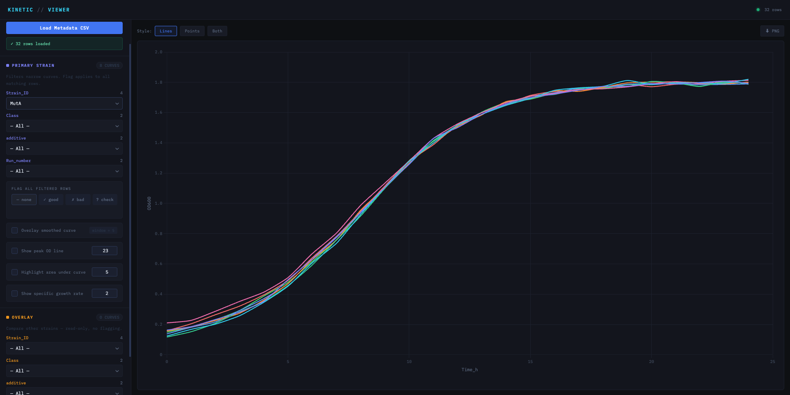

# Kinetic Data Viewer

A Django app for visualising overlaid kinetic line charts from a metadata CSV.



## Quick Start

```bash
# 1. Install dependencies
pip install django pandas

# 2. Run the development server
cd kinetic_viewer
python manage.py runserver

# 3. Open http://127.0.0.1:8000
```

## How to Use

1. **Enter the full path** to your metadata CSV in the sidebar input
2. Click **Load Metadata CSV** — the app reads the file and populates all filter dropdowns
3. **Select filters** (Strain_ID, Class, additive, Run_number) to narrow down curves
4. All matching kinetic files are loaded and **overlaid on the chart automatically**
5. Click any series in the legend to **toggle visibility**
6. Use **Export PNG** to download the chart

## Metadata CSV format

| Strain_ID | Class     | additive | Run_number | PATH_TO_KINETIC_DATA          |
|-----------|-----------|----------|------------|-------------------------------|
| WT        | control   | none     | 1          | /data/kinetics/wt_ctrl_1.csv  |
| MutA      | treatment | glucose  | 2          | /data/kinetics/mutA_trt_2.csv |

- `PATH_TO_KINETIC_DATA` must be the **absolute path** to each kinetic CSV file.

## Kinetic CSV format

Each file must have exactly **2 columns** — first column is the time axis, second is the measurement:

```
Time_h,OD600
0,0.05
1,0.07
2,0.10
...
```

## Sample Data

Generate 32 test curves to try the app immediately:

```bash
python generate_sample_data.py
# Then load: sample_data/metadata.csv
```
